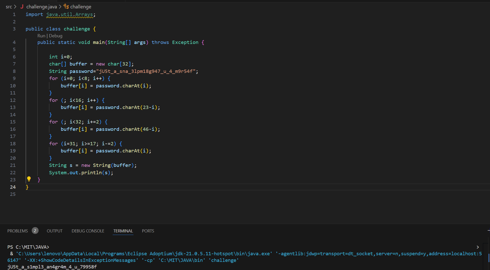

## 1. GDB baby step 1

**Flag-**    
picoCTF{549698}

> ### **Thought Process-**
> In this challenge with the help of the hint I can to know about `GDB`, after knowing how to work on it I first intalled it on `WSL` using command
  `sudo apt install gdb` after intalling I ran `gdb debugger0_a` then made a break point at main using `break main` after this I used the command `run`
  from this point I kept on running each and every intruction in main one-by-one using command `stepi` along with it I kept a check on value in `eax`,
  when it changed I disassembled the main function and checked where I was in the main function. After reading the assembly code I figured out the
  required value and got the flag.

**My Working-**         
(After setting up break point and running the program)      
 ```bash
Breakpoint 1, 0x0000555555555131 in main ()
(gdb) print $eax
$1 = 1431654697
(gdb) stepi
0x0000555555555134 in main ()
(gdb) print $eax
$2 = 1431654697
(gdb) stepi
0x0000555555555138 in main ()
(gdb) print $eax
$3 = 1431654697
(gdb) stepi
0x000055555555513d in main ()
(gdb) print $eax
$4 = 549698
(gdb) diassemble main
Undefined command: "diassemble".  Try "help".
(gdb) disassemble main
Dump of assembler code for function main:
   0x0000555555555129 <+0>:     endbr64
   0x000055555555512d <+4>:     push   %rbp
   0x000055555555512e <+5>:     mov    %rsp,%rbp
   0x0000555555555131 <+8>:     mov    %edi,-0x4(%rbp)
   0x0000555555555134 <+11>:    mov    %rsi,-0x10(%rbp)
   0x0000555555555138 <+15>:    mov    $0x86342,%eax
=> 0x000055555555513d <+20>:    pop    %rbp
   0x000055555555513e <+21>:    ret
End of assembler dump.
(gdb) stepi
0x000055555555513e in main ()
(gdb)

 ```


## 2. ARMssembly 1

**Flag-**     
picoCTF{0000004d}

> ### **Thought Process-**
> Here first of all I went through the the provided source for assembly language a number of times to understand the working of assembly language. After that I
  interpreted what the given assembly program was trying to do, it was basically performing some arithmetic operations on numbers 58,2,3 so according to 
  the operations I had to enter an argument that should result in '0' after all operations.

 Here is what i  interpreted from the given file `chall_1.S` for the challenge
```bash
	.arch armv8-a
	.file	"chall_1.c"
	.text
	.align	2
	.global	func
	.type	func, %function
func:
	sub	sp, sp, #32
	str	w0, [sp, 12]
	mov	w0, 58
	str	w0, [sp, 16]
	mov	w0, 2
	str	w0, [sp, 20]
	mov	w0, 3
	str	w0, [sp, 24]
	ldr	w0, [sp, 20]
	ldr	w1, [sp, 16]
	lsl	w0, w1, w0	; w0=232
	str	w0, [sp, 28] 
	ldr	w1, [sp, 28] 	; w1=232
	ldr	w0, [sp, 24]	; w0=3
	sdiv	w0, w1, w0	; w0 = 232/3=77
	str	w0, [sp, 28]
	ldr	w1, [sp, 28] 	; w1=77
	ldr	w0, [sp, 12]
	sub	w0, w1, w0 	; 77-first_arg
	str	w0, [sp, 28]
	ldr	w0, [sp, 28]
	add	sp, sp, 32
	ret
	.size	func, .-func
	.section	.rodata
	.align	3
.LC0:
	.string	"You win!"
	.align	3
.LC1:
	.string	"You Lose :("
	.text
	.align	2
	.global	main
	.type	main, %function
main:
	stp	x29, x30, [sp, -48]!
	add	x29, sp, 0		; x29 = sp + 0
	str	w0, [x29, 28]
	str	x1, [x29, 16]
	ldr	x0, [x29, 16]
	add	x0, x0, 8
	ldr	x0, [x0]
	bl	atoi
	str	w0, [x29, 44]
	ldr	w0, [x29, 44]
	bl	func
	cmp	w0, 0
	bne	.L4
	adrp	x0, .LC0
	add	x0, x0, :lo12:.LC0
	bl	puts
	b	.L6
.L4:
	adrp	x0, .LC1
	add	x0, x0, :lo12:.LC1
	bl	puts
.L6:
	nop
	ldp	x29, x30, [sp], 48
	ret
	.size	main, .-main
	.ident	"GCC: (Ubuntu/Linaro 7.5.0-3ubuntu1~18.04) 7.5.0"
	.section	.note.GNU-stack,"",@progbits

```


## 3. Vault door 3

**Flag-**   
picoCTF{jU5t_a_s1mpl3_an4gr4m_4_u_79958f}

> ### **Thought Process-**   
>First after knowing that in this challenge I had to use java, I recalled my prexisting knowledge of java and on reading the whole program I realised that it 
basically wants the correct password which could be easily seen in the program itself but the thing was that whatsoever I input it gets manipulated by some
`for` loops. So I created another by copying the `for` loops but in this program i reversed the input and the final `string` which I got was the the content
of the flag.

**Program Created**          



**CHALLENGE PROGRAM**      
```bash
import java.util.*;

class VaultDoor3 {
    public static void main(String args[]) {
        VaultDoor3 vaultDoor = new VaultDoor3();
        Scanner scanner = new Scanner(System.in);
        System.out.print("Enter vault password: ");
        String userInput = scanner.next();
	String input = userInput.substring("picoCTF{".length(),userInput.length()-1);
	if (vaultDoor.checkPassword(input)) {
	    System.out.println("Access granted.");
	} else {
	    System.out.println("Access denied!");
        }
    }

    // Our security monitoring team has noticed some intrusions on some of the
    // less secure doors. Dr. Evil has asked me specifically to build a stronger
    // vault door to protect his Doomsday plans. I just *know* this door will
    // keep all of those nosy agents out of our business. Mwa ha!
    //
    // -Minion #2671
    public boolean checkPassword(String password) {
        if (password.length() != 32) {
            return false;
        }
        char[] buffer = new char[32];
        int i;
        for (i=0; i<8; i++) {
            buffer[i] = password.charAt(i);
        }
        for (; i<16; i++) {
            buffer[i] = password.charAt(23-i);
        }
        for (; i<32; i+=2) {
            buffer[i] = password.charAt(46-i);
        }
        for (i=31; i>=17; i-=2) {
            buffer[i] = password.charAt(i);
        }
        String s = new String(buffer);
        return s.equals("jU5t_a_sna_3lpm18g947_u_4_m9r54f");
    }
}

```
**OUTPUT**    
```
Enter vault password: picoCTF{jU5t_a_s1mpl3_an4gr4m_4_u_79958f}
Access granted.
```


